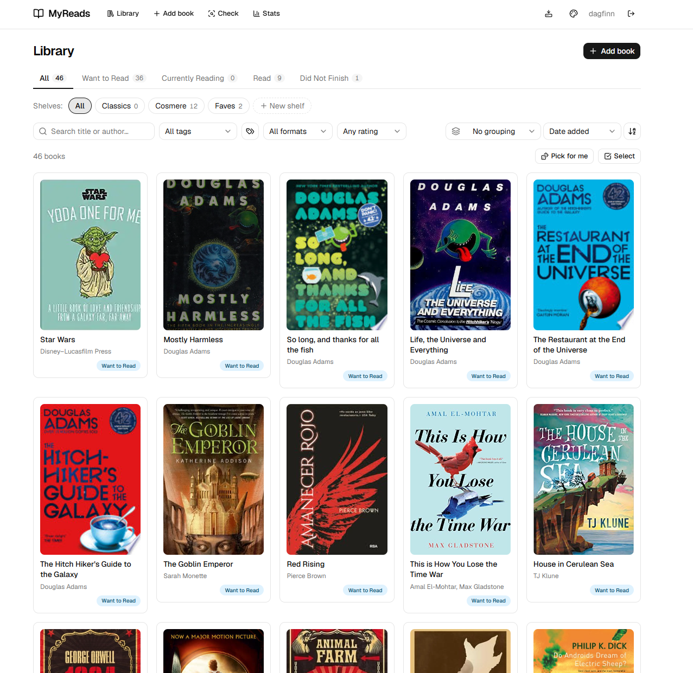
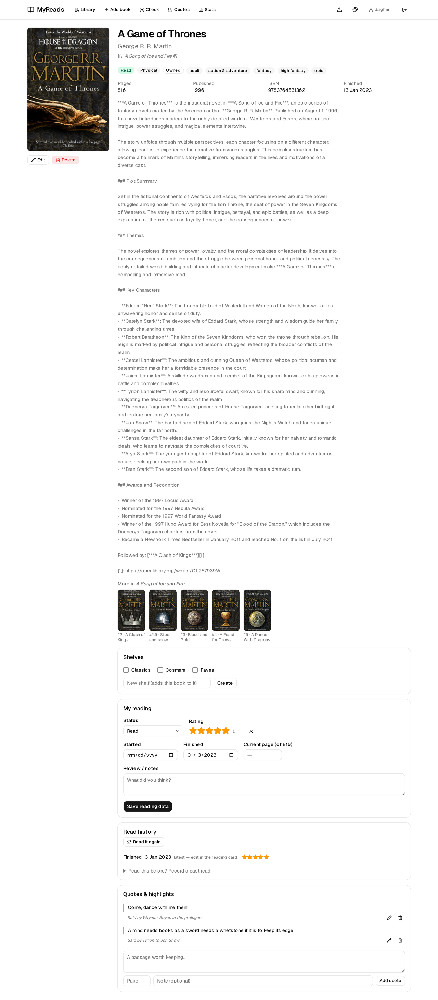
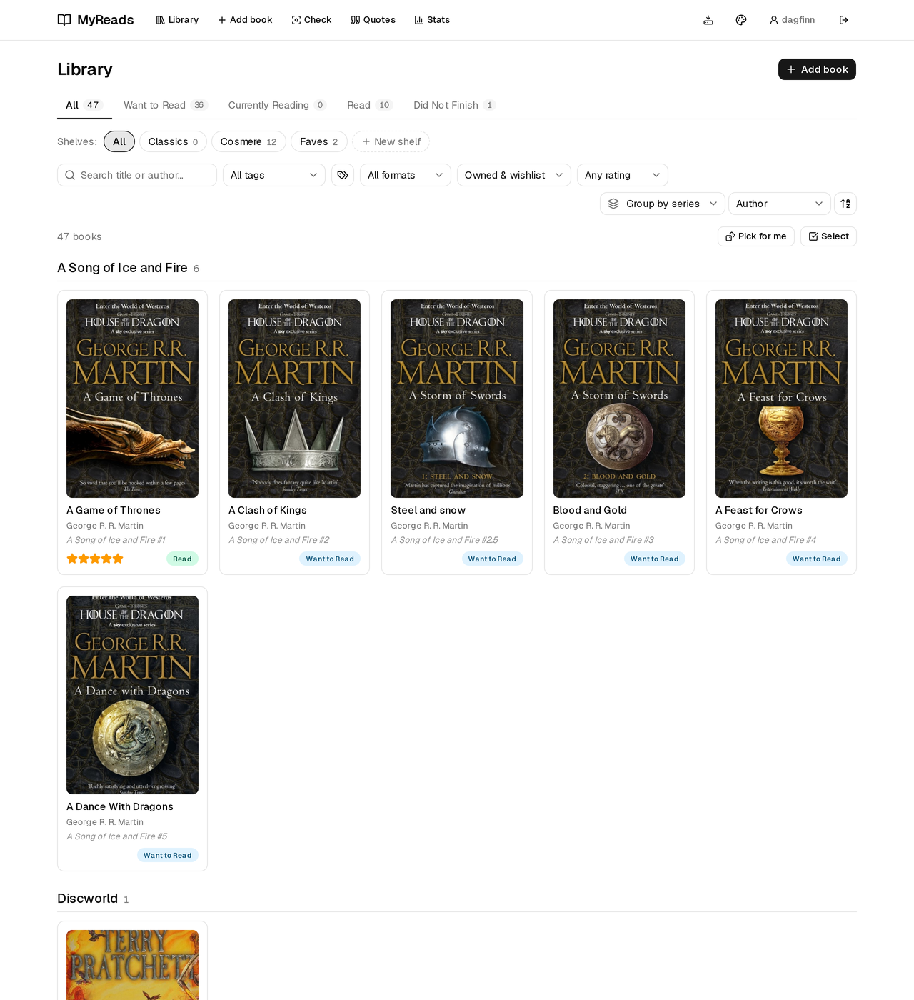
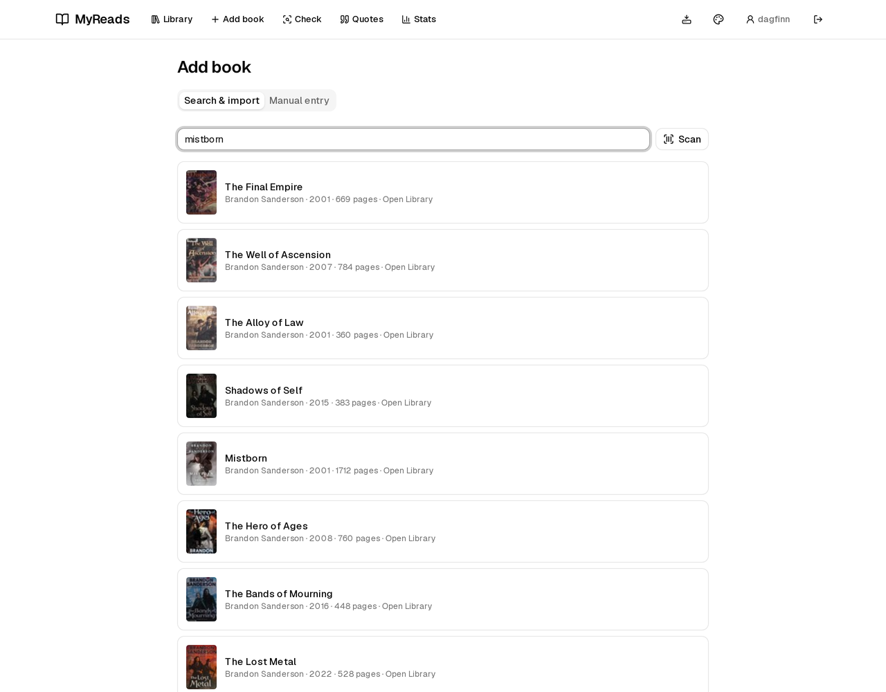
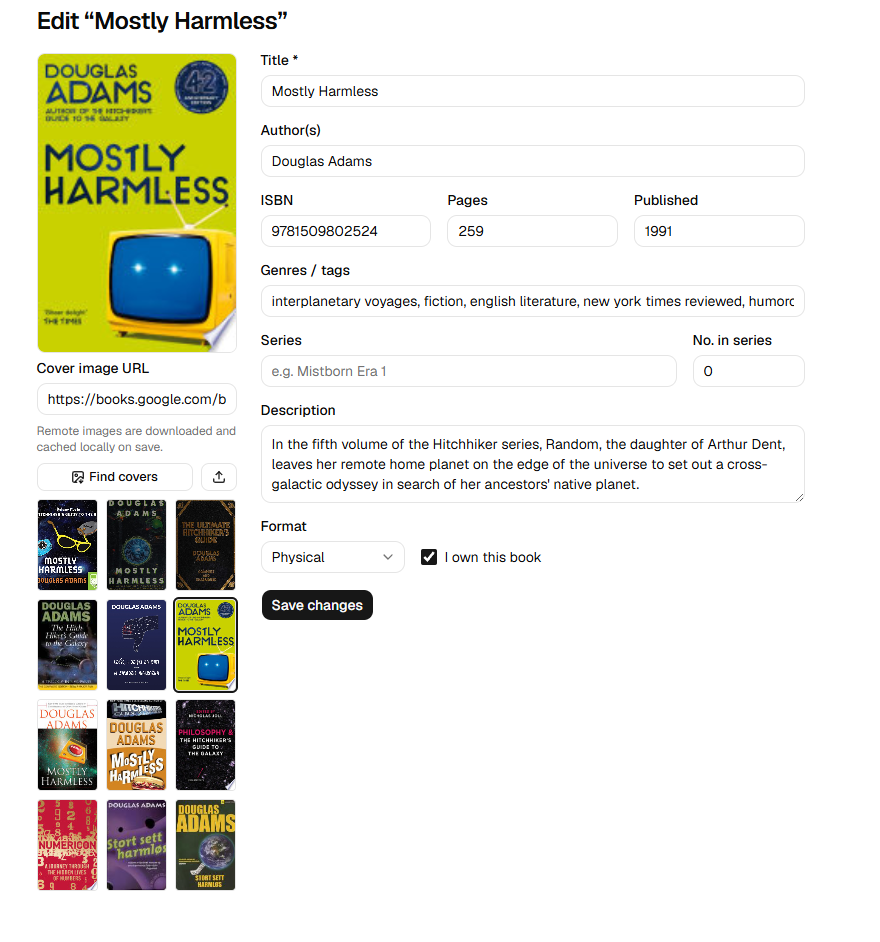
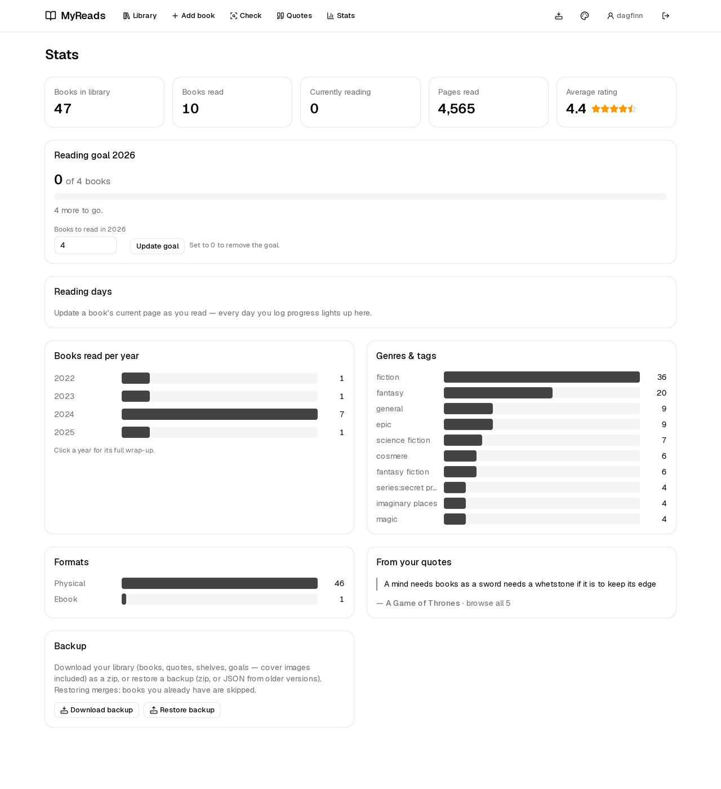
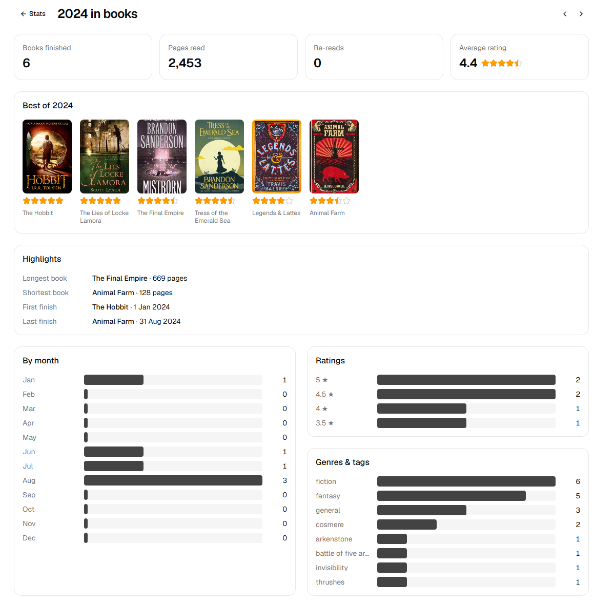
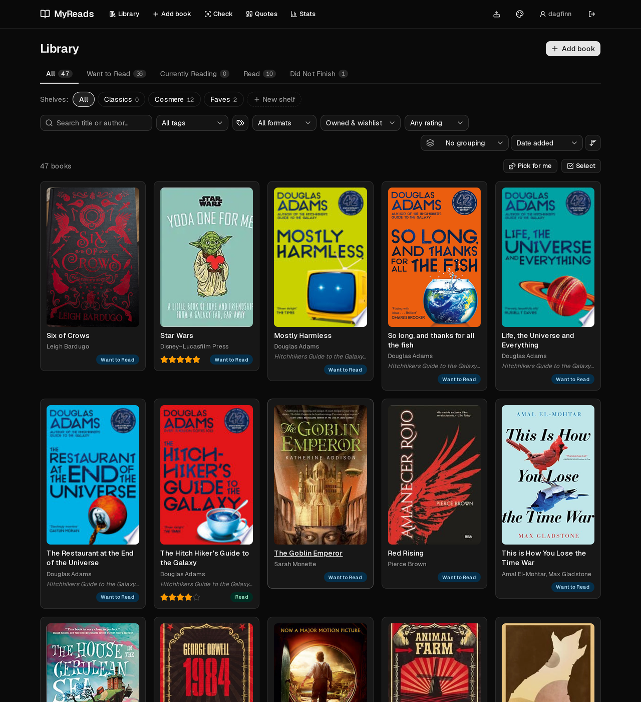
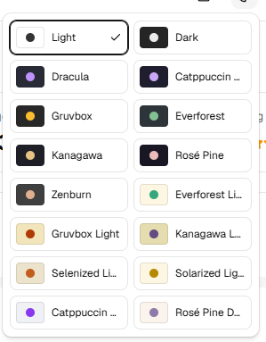
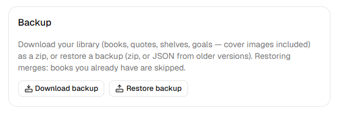

# MyReads

A self-hosted, single-purpose personal book library. Think *GoodReads, but
just for you*: catalog the books you own, track what you're reading, rate and
review everything — with no friends, feeds, follows, or any other social
surface area.



## Features

- **Book catalog** — add books manually or via search-and-import, with title,
  author(s), ISBN, cover, description, page count, publish date, genre/tags,
  format (physical / ebook / audiobook), and an owned flag. Full edit/delete.
- **Search & import** — search-as-you-type against the
  [Open Library API](https://openlibrary.org/developers/api) (free, no key).
  Optionally enriched by the Google Books API when `GOOGLE_BOOKS_API_KEY` is
  set, with the [National Library of Norway](https://api.nb.no/) as a final
  fallback for titles the others don't know (it has essentially every book
  ever published in Norway). Every fetched field is reviewable/editable
  before saving, responses are cached in Postgres for a week, and cover
  images are downloaded into a local cache so the app never depends on
  third-party image hosting.
- **Cover picker & custom covers** — the book form can search all three
  sources for candidate covers (exact ISBN matches first, so the edition you
  own wins — scan a Norwegian barcode, get the Norwegian cover) and lets you
  pick one visually. You can also paste any image URL or upload your own
  photo of the book.
- **ISBN barcode scanning** — point a camera at the barcode on a physical
  book and it's looked up and prefilled automatically (a single match skips
  straight to the review form). Uses the browser's native `BarcodeDetector`
  (Chrome/Edge, incl. Chrome on Android). Note: browsers only allow camera
  access over **HTTPS or localhost** — behind a reverse proxy with TLS it
  just works; on a plain `http://LAN-IP` address it can't.
- **"Do I own this?" bookstore mode** — scan a barcode (or type an ISBN) on
  the Check page and instantly see whether the book is already in your
  library: the exact edition (matched by ISBN in both its 10- and 13-digit
  forms), the same title as a different edition, or not there at all — with
  a one-tap handoff to the add flow, ISBN prefilled. Installed as a PWA, the
  home-screen icon's long-press menu jumps straight to it. The add flow also
  warns when you're about to import a book you already have.
- **Bulk edit** — flip the library into select mode, tick any number of
  books (or "Select all" within the current filter), and set status, add
  tags, or shelve them in one action.
- **Personal reading data** — status (Want to Read / Currently Reading /
  Read / Did Not Finish), 1–5 star ratings **with half stars**, free-text
  review/notes, start & finish dates, and reading progress ("page 218 of
  618") with a progress bar on the library card.
- **Read history & re-reads** — every pass through a book is kept: "Read it
  again" archives the current dates and rating and restarts the book, and
  reads from before the app can be recorded (dates optional, with what you
  rated it that time). Re-reads count in the per-year stats and toward
  reading goals; "times read" is derived from the history.
- **Reading log, pace & forecast** — every change to "current page" is kept
  as a dated log entry, at no extra effort: the book page draws the current
  read as a progress-over-time sparkline with your pages-per-day pace and,
  while you're mid-book, a finish forecast ("on pace to finish 3 Aug").
  Finished books show the shape of the read instead. A collapsible log lists
  every entry with delete buttons, and entries ride along in backups. Books
  mid-read when you upgrade are seeded with their current position so pace
  works from your first update.
- **Reading-days heatmap** — a GitHub-style calendar of the last 12 months
  on the stats page, tinted by pages read per day (counted as the increase
  between consecutive log entries of each book), with reading-day and
  streak counts above it.
- **Quotes & highlights** — keep passages from a book, each with an optional
  page reference and a personal note, added/edited/deleted right on the book
  page. Quotes are listed in page order and included in backups.
- **Series** — assign books a series name and number (floats allowed, so a
  novella can be #1.5). Book pages link the series and show its other
  entries in reading order; the library can group by series.
- **Custom shelves** — freeform, user-created shelves ("Sanderson",
  "Fantasy") independent of reading status. A book can sit on any number of
  shelves; deleting a shelf never touches its books.
- **Library views** — status shelves, custom-shelf chips, text search across
  title/author/series, filters by tag, format, and minimum rating, grouping
  by author or series, sorting by title, author, rating, date added, or date
  finished. Sorting by author keeps each series together as a block in
  series order — Mistborn #1 sits next to #2 instead of being alphabetized
  apart. All view state lives in the URL. A "Pick for me" button opens a
  random book from Want to Read (respecting the active filters) when you
  can't decide.
- **Tag management** — rename a tag across the whole library (renaming onto
  an existing tag merges them) or remove one everywhere, from a small dialog
  next to the tag filter.
- **Stats dashboard** — books read per year, average rating, total pages
  read, genre and format breakdowns.
- **Year in review** — click any year on the stats page for its wrap-up:
  books and pages read, re-reads, best-of shelf, longest/shortest/fastest
  read, first and last finish, monthly rhythm, rating distribution, and top
  genres for that year.
- **Reading goals** — set a yearly goal ("24 books in 2026") on the stats
  page and watch the progress bar fill; hit the target and you earn a gold
  medal. Past years' goals (and medals) stay on display.
- **Backup & restore** — one click downloads your entire library (books,
  quotes, read history, the reading log, shelves, reading goals, **and
  cover images**) as a
  zip, and the
  stats page can restore such a backup into any instance — covers included,
  so a restore onto a fresh server looks exactly like the original. Restores
  merge: books you already have are skipped, so it's safe to run on a live
  library. Plain-JSON backups from older versions restore fine too.
- **Sixteen themes that follow you** — the picked theme is saved on your
  account and server-rendered on first paint, so signing in from a new
  browser or device brings your look along (localStorage still covers the
  signed-out pages).
- **Installable (PWA)** — a web app manifest makes MyReads installable on a
  phone home screen, which pairs nicely with barcode scanning. Same browser
  rule as the scanner: manifests only apply over **HTTPS or localhost**.
  Add the shortcut from a plain `http://LAN-IP` address and Android ignores
  the manifest entirely — you get a bare bookmark with a letter tile instead
  of the app icon. Behind a TLS reverse proxy it installs with the proper
  icon and name.
- **Auth** — username/password accounts via Auth.js (Credentials provider),
  bcrypt-hashed passwords, JWT sessions. Registration can be disabled once
  your account exists.

Deliberately out of scope: anything social, recommendation engines, CSV
import.

## Screenshots

**Book page** — bibliographic details, the rest of the series in reading
order, shelves, and your own reading data below:



**Grouped by series** — each series becomes its own shelf heading, in
reading order (novellas slot in at #2.5):



**Search & import** — type a title, author, or ISBN (or scan the barcode)
and pick a result to prefill the form:



**Cover picker** — candidate covers from all three sources, exact ISBN
matches first; the Norwegian editions come courtesy of the National
Library:



**Stats & reading goals** — with backup & restore a click away:



**Year in review** — any year's wrap-up: the best-of shelf, highlights,
monthly rhythm, ratings, and top genres:



**Dark mode** — one of sixteen themes:



| Theme picker | Backup & restore |
| --- | --- |
|  |  |

## Quick start (Docker)

Requirements: Docker with the compose plugin.

```bash
git clone https://github.com/dagfinn2000/myreads.git
cd myreads
cp .env.example .env
# edit .env: set POSTGRES_PASSWORD and AUTH_SECRET (openssl rand -base64 32)
docker compose up -d
```

That's it. The app container waits for Postgres to be healthy, applies
database migrations automatically, and starts on
[http://localhost:3000](http://localhost:3000). Register an account and start
adding books.

Data persists in two named volumes: `pgdata` (the database — your entire
library) and `covers` (cached cover images).

## Environment variables

All configuration is documented inline in [.env.example](.env.example).
Summary:

| Variable | Required | Purpose |
| --- | --- | --- |
| `POSTGRES_USER` / `POSTGRES_DB` | no (default `myreads`) | Postgres credentials for the compose `db` service |
| `POSTGRES_PASSWORD` | **yes** | Postgres password; compose refuses to start without it |
| `AUTH_SECRET` | **yes** | Signs session JWTs — generate with `openssl rand -base64 32` |
| `AUTH_TRUST_HOST` | yes (keep `true`) | Required by Auth.js on self-hosted deployments |
| `DATABASE_URL` | outside Docker only | Connection string for local dev / the Prisma CLI; inside Docker compose assembles it from the `POSTGRES_*` values |
| `GOOGLE_BOOKS_API_KEY` | no | Enables Google Books as search fallback + metadata enrichment |
| `COVERS_DIR` | no | Cover cache directory (Docker sets `/app/data/covers`; local dev defaults to `./data/covers`) |
| `DISABLE_REGISTRATION` | no | `true` blocks new accounts after you've made yours |
| `APP_PORT` | no | Host port for the app (default `3000`) |

## Local development

Requirements: Node 22+, a Postgres instance (the compose `db` service works
fine for this).

```bash
cp .env.example .env       # set POSTGRES_PASSWORD, AUTH_SECRET
# start just the database, with 5432 published on localhost (dev override —
# the base compose file deliberately keeps Postgres unexposed)
docker compose -f docker-compose.yml -f docker-compose.dev.yml up -d db
npm install
npx prisma migrate deploy  # apply migrations (DATABASE_URL points at localhost)
npm run dev                # http://localhost:3000
```

Useful scripts: `npm run build` (prisma generate + production build),
`npm run db:studio` (browse the DB), `npm run db:migrate` (apply migrations).

## Tech stack

- **[Next.js 15](https://nextjs.org/)** (App Router, TypeScript) — UI and API
  routes in one codebase, standalone output for a small Docker image
- **[PostgreSQL](https://www.postgresql.org/)** + **[Prisma](https://www.prisma.io/)**
- **[Auth.js v5](https://authjs.dev/)** (NextAuth) — Credentials provider,
  JWT sessions, bcryptjs hashing
- **[Tailwind CSS v4](https://tailwindcss.com/)** + **[shadcn/ui](https://ui.shadcn.com/)**
- **[Zod](https://zod.dev/)** for validation

## Architecture notes

```
src/
├─ app/
│  ├─ (auth)/          login & register (no nav shell)
│  ├─ (app)/           authenticated pages: books, books/new, books/[id],
│  │                   books/[id]/edit, stats
│  └─ api/             auth (Auth.js), register, metadata search/details,
│                      cached cover serving
├─ components/         UI (shadcn/ui in components/ui, app components beside)
├─ lib/
│  ├─ actions/books.ts server actions: create/update/delete + reading data
│  ├─ metadata/        Open Library + Google Books + nb.no clients, DB cache
│  ├─ covers.ts        cover image download/cache
│  └─ validation.ts    zod schemas shared by actions and API routes
├─ auth.config.ts      edge-safe Auth.js config (used by middleware)
├─ auth.ts             full Auth.js config (Credentials + Prisma + bcrypt)
└─ middleware.ts       route protection
```

Design decisions worth knowing about:

- **Reading data lives on the Book row.** Books are per-user in this app, so
  a separate "reading entry" join model would add indirection for nothing.
  The Book row always holds the *latest* read; earlier passes are archived
  in the `Read` table, and `timesRead` is derived from the two.
- **Ratings are integers 1–10** (half-star units); `7` renders as 3.5 stars.
- **Metadata caching is a read-through table** (`MetadataCache`) keyed by
  `(source, normalized query)` with a one-week TTL and stale-if-error
  fallback, so a flaky Open Library never breaks previously working lookups.
- **Cover images are cached locally.** On save, a remote cover URL is
  downloaded to `COVERS_DIR` and the book is repointed to
  `/api/covers/<id>.<ext>`; deletion cleans the file up. Failures are
  non-fatal (the remote URL simply stays).
- **Mutations are server actions** with per-user ownership checks;
  list/detail pages are server components querying Prisma directly. The only
  client-fetch API routes are the metadata endpoints (interactive search) and
  cover serving.
- **Migrations run on container start** (`prisma migrate deploy` in the
  entrypoint) — first boot creates the schema, upgrades apply pending
  migrations, and an already-migrated DB is a no-op.

## License

[MIT](LICENSE)
